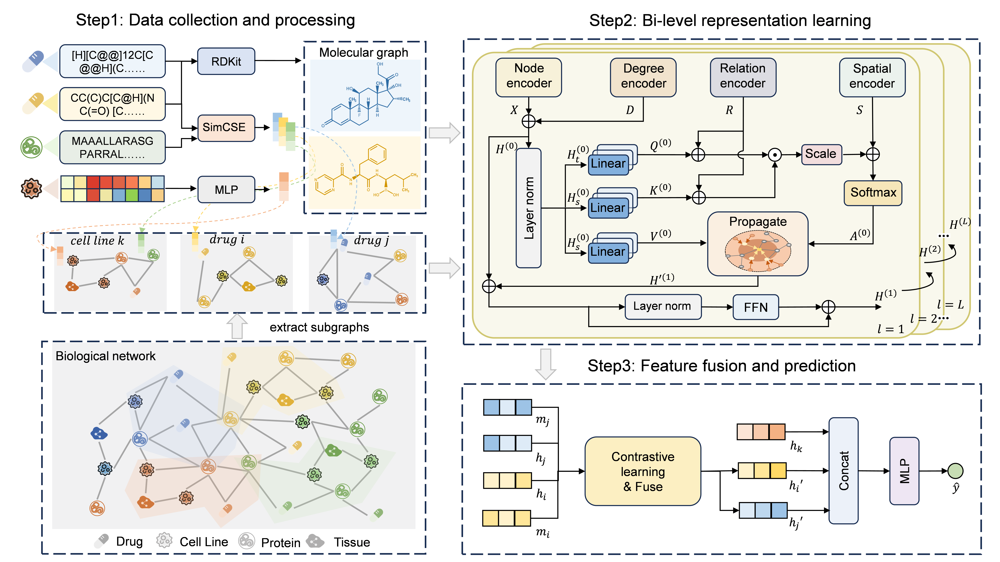

# BiGSyn

BiGSyn: A Bi-Level Heterogeneous Graph Contrastive Learning Framework for Interpretable Drug Synergy Prediction.



## Repository Layout

```text
code/                  Training, evaluation, data loading, and utility code
models/                BiGTSynergy model implementation
randomWalk/            Random-walk subgraph extractor
data/                  Raw and processed DrugCombDB/Oneil data
best_save/             Saved checkpoints and per-fold evaluation logs
```

## Reproduce Saved Test Results

Run commands from the `code/` directory. The commands below evaluate the saved checkpoints in `best_save/` and produce per-fold predictions plus `topk_metrics.txt` in the corresponding checkpoint directory.

### DrugCombDB

```bash
cd code
python main.py --dataset DrugCombDB --model BiGTSynergy --arch both --extractor randomWalk --size 32 --seed 0 --cv_mode 1 --test ../best_save/DrugCombDB_both
```

### Oneil

```bash
cd code
python main.py --dataset Oneil --model BiGTSynergy --arch both --extractor randomWalk --size 32 --seed 0 --cv_mode 1 --test ../best_save/Oneil_both
```

## Saved Results

The following table is computed from the saved `test_results.json` files in `best_save/<dataset>_both/randomWalk/fold_*/<auc>/`. Values are reported as mean +/- std over the 5 folds, using the same population standard deviation convention as `code/utils.py`.

| Dataset | Acc | Prec | Rec | AUC | AUPR | F1 | Loss |
| --- | ---: | ---: | ---: | ---: | ---: | ---: | ---: |
| DrugCombDB | 0.86762 +/- 0.00329 | 0.86948 +/- 0.01057 | 0.86540 +/- 0.00710 | 0.93830 +/- 0.00261 | 0.93832 +/- 0.00295 | 0.86735 +/- 0.00209 | 0.93564 +/- 0.05353 |
| Oneil | 0.88832 +/- 0.02568 | 0.91030 +/- 0.03295 | 0.87810 +/- 0.03095 | 0.94377 +/- 0.01068 | 0.95189 +/- 0.01029 | 0.89342 +/- 0.02413 | 1.13011 +/- 0.05364 |

### Per-Fold Results

| Dataset | Fold | Acc | Prec | Rec | AUC | AUPR | F1 | Loss |
| --- | ---: | ---: | ---: | ---: | ---: | ---: | ---: | ---: |
| DrugCombDB | 0 | 0.86684 | 0.87120 | 0.86097 | 0.93639 | 0.93596 | 0.86605 | 1.01155 |
| DrugCombDB | 1 | 0.86260 | 0.85315 | 0.87598 | 0.93566 | 0.93670 | 0.86441 | 0.85433 |
| DrugCombDB | 2 | 0.87141 | 0.87883 | 0.86162 | 0.93939 | 0.93730 | 0.87014 | 0.96453 |
| DrugCombDB | 3 | 0.86619 | 0.86240 | 0.87141 | 0.93719 | 0.93751 | 0.86688 | 0.94445 |
| DrugCombDB | 4 | 0.87108 | 0.88180 | 0.85705 | 0.94288 | 0.94412 | 0.86925 | 0.90337 |
| Oneil | 0 | 0.91371 | 0.95833 | 0.87619 | 0.95445 | 0.96475 | 0.91542 | 1.07789 |
| Oneil | 1 | 0.87310 | 0.89216 | 0.86667 | 0.93872 | 0.94036 | 0.87923 | 1.15426 |
| Oneil | 2 | 0.85787 | 0.85981 | 0.87619 | 0.92536 | 0.93913 | 0.86792 | 1.21456 |
| Oneil | 3 | 0.92386 | 0.92453 | 0.93333 | 0.95238 | 0.95879 | 0.92891 | 1.06760 |
| Oneil | 4 | 0.87310 | 0.91667 | 0.83810 | 0.94793 | 0.95641 | 0.87562 | 1.13626 |

## Command Used to Generate the Tables

The summary and per-fold tables above can be regenerated from the saved JSON files with this PowerShell command from the repository root:

```powershell
$rows = Get-ChildItem -Recurse -Filter test_results.json best_save | ForEach-Object {
    $parts = $_.FullName.Split([IO.Path]::DirectorySeparatorChar)
    $dataset = $parts[$parts.IndexOf('best_save') + 1] -replace '_both',''
    $fold = (($parts | Where-Object { $_ -like 'fold_*' }) -replace 'fold_','')
    $r = Get-Content $_.FullName -Raw | ConvertFrom-Json
    [PSCustomObject]@{
        Dataset = $dataset
        Fold = [int]$fold
        Acc = [double]$r.acc
        Prec = [double]$r.prec
        Rec = [double]$r.rec
        AUC = [double]$r.auc
        AUPR = [double]$r.aupr
        F1 = [double]$r.f1
        Loss = [double]$r.loss
    }
}

$rows | Sort-Object Dataset,Fold | Format-Table -AutoSize
$rows | Group-Object Dataset | ForEach-Object {
    $group = $_.Group
    foreach ($metric in 'Acc','Prec','Rec','AUC','AUPR','F1','Loss') {
        $mean = ($group.$metric | Measure-Object -Average).Average
        $std = [math]::Sqrt((($group.$metric | ForEach-Object { [math]::Pow($_ - $mean, 2) }) | Measure-Object -Average).Average)
        "{0} {1}: {2:N5} +/- {3:N5}" -f $_.Name, $metric, $mean, $std
    }
}
```

## Notes

- Saved checkpoints are loaded from `best_save/<dataset>_both/randomWalk/fold_<k>/<auc>/BiGTSynergy.pt`.
- The current `code/main.py` defaults to test mode because `--test` has a non-null default. Pass `--test` explicitly as shown above to select the saved checkpoint set.
- Training from scratch uses the `args.test is None` branch in `code/main.py`; restore the commented `train` and `eval` imports before launching a fresh training run.
